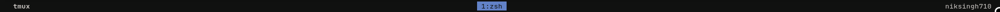
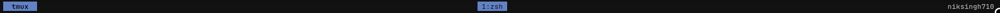
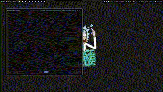

<center>

[](LICENSE)


</center>

# Tmux Status Theme



## Introduction

Welcome to the **Tmux Status Theme** project! This theme was created with a focus on minimalism and essential elements, ensuring a clean and distraction-free Tmux status bar. Whether you're an experienced Tmux user or just getting started, this theme offers a seamless experience with support for the `prefix key press`.

## Features

- **Minimalistic Design:** Enjoy a clutter-free Tmux status bar that only displays relevant information.
- **Prefix Key Support:** Easily distinguish between Tmux's standard and prefix modes.
- **Color of Indicator** Change the color of the indicator.

## Previews

### Without Prefix


### With Prefix



### GIF




## Variables to Configure

```
# These are the default values used inside the plugin to acheive the preview shown above.

set -g @minimal-tmux-bg "#698DDA"
set -g @minimal-tmux-justify "centre"
set -g @minimal-tmux-indicator-str "  tmux  "
set -g @minimal-tmux-indicator true
set -g @minimal-tmux-status "bottom"

# Enables or disables the left and right status bar
set -g @minimal-tmux-right true
set -g @minimal-tmux-left true

# expanded icon (fullscreen icon) 
set -g @minimal-tmux-expanded-icon " 󰊓 "

#on all tabs (default is false)
# false will make it visible for the current tab only
set -g @minimal-tmux-show-expanded-icons-for-all-tabs true

# To add or remove extra text in status bar
set -g @minimal-tmux-status-right-extra ""
set -g @minimal-tmux-status-left-extra ""

# Not recommended to change these values
set -g @minimal-tmux-status-right "#S"
set -g @minimal-tmux-status-left "refer to code"

# If getting strings cut in left status or right 
# Here 20 is the length of the characters in the string
set -g status-left-right 20
set -g status-left-length 20

```

## Installation via Tmux Plugin Manager (TPM)

I recommend using [Tmux Plugin Manager (TPM)](https://github.com/tmux-plugins/tpm) for easy installation:

1. Add the theme to your list of TPM plugins in your `~/.tmux.conf`:

   ```bash
   set -g @plugin 'niksingh710/minimal-tmux-status'
   ```

2. Press `prefix` + <kbd>I</kbd> (capital "i", as in Install) to fetch and install the plugin.

3. Reload your Tmux configuration:

   ```bash
   tmux source-file ~/.tmux.conf
   ```

That's it! Your Tmux Status Theme is now installed and ready to use.

### Tip

Add this line in your tmux config so that you can easily toggle tmux status bar with one keymap.
```
bind-key b set-option status
```
Now pressing `prefix+b` will toggle status bar

## Contributing

If you believe this theme can benefit from additional features or improvements without compromising its minimalism, I welcome your contributions. Please create a pull request with your changes, and we'll be happy to review and merge if they align with the project's goals.

## Feedback

I value your feedback and suggestions. If you have any ideas for improving this theme or encounter any issues, please don't hesitate to open an issue on GitHub.


Thank you for considering the **Tmux Status Theme** for your Tmux setup. I hope it enhances your Tmux experience with its minimalist design and efficient use of screen real estate. Happy coding! 😊👍

